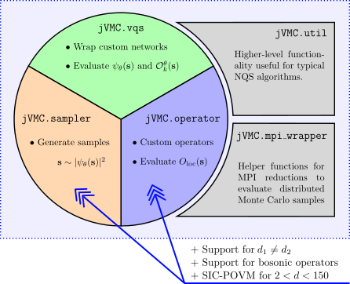
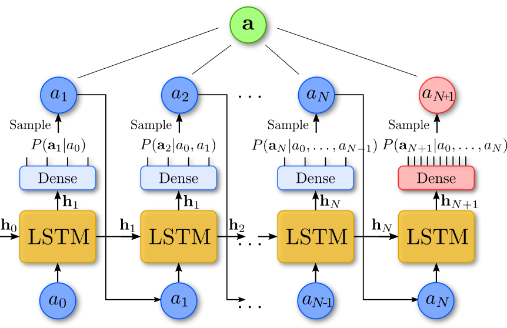

# jVMC_cavity
## _Extension of the jVMC codebase for lattice-cavity systems_

_(figure adapted from the original jVMC paper *[arxiv:2108.03409](https://arxiv.org/abs/2108.03409)*)_
# Why do you need this extension
`jVMC` codebase provides a complete framework to calculate time evolution of large 1-D and 2-D open quantum systems
using POVMs and neural networks. For simplicity it is assumed that the local Hilbert space dimension of the lattice 
is $$d=2$$, i.e., one can only simulate spin-1/2 systems. 

This extension allows one to handle dimensions $$2<d<150$$, as well as different local dimensions
for the lattice (dimension $$d_1$$) and some other single-body quantum system, eg. a photonic cavity 
(dimension $$d_2$$).

# Disclaimer
Tomasz Szołdra is not an author of the original `jVMC` package. This extension was not officially approved by the 
creators of the `jVMC` software. This project is still in the development phase.

# How it works
- Dimensions $$2<d<150$$ for SIC-POVMs are implemented using the `qbsim` package. 

- We add an extra lattice site with index $$L$$ that contains the configuration of the cavity mode. 
It can have a different local dimension than the lattice sites indexed by $$0...(L-1)$$.

- Operators acting on the cavity mode must act on lattice site with index $$L$$.

# Working
- Time evolution of an open system: 1-D lattice and cavity, single- and 2-body terms in the Hamiltonian
- Spin X, Y, Z operators for any spin S
- Bosonic creation, annihilation, number operators
- Single-body observables: X, Y, Z and bosonic operators

# Not yet implemented
- 2-D systems
- Observables: 2-body correlations

# Autoregressive sampling for lattice-cavity system
In a normal setting, a dense layer (blue) is applied to the hidden state of the RNN and the log-probabilities of all
configurations are returned. In the presence of cavity, autoregressive sampling is still possible after a slight modification. 
To support the cavity mode with a different local dimension, another independent dense
layer (red) is added. Then $$\mathbf{a}$$ is the configuration of the lattice and cavity.

It is important to note that there is another dense layer at the input to the LSTM/RNN. This change was adopted in jVMC 
commit *[a8cf7c5](https://github.com/markusschmitt/vmc_jax/commit/a8cf7c5a71886ebb38db5a2dcf0eb9dddd4f2118)*.

## Installation
1. We recommend you create a new conda environment to work with `jVMC_cavity`:

        conda create -n jvmc_cavity python=3.9
        conda activate jvmc_cavity

5. Install two packages manually with `conda`:

        conda install mpi4py qutip

2. Download the package

        git clone https://github.com/tszoldra/jVMC_cavity
        cd jVMC_cavity

4. ``pip``-install the package

        pip install jVMC_cavity

<!---
442  conda create --name jaxgpu
443  conda activate jaxgpu
444  conda install mpi4py
445  python
446  conda install qutip
447  pip install qbism
448  python
449  conda install python=3.9.7
450  python --version
451  conda install qutip
452  cd jvmc/SpinPhoton2/vmc_jax/ # modified setup.py to not install jax - we will install it by hand
453  pip install -e .
454  pip install --upgrade "jax[cuda]" -f https://storage.googleapis.com/jax-releases/jax_releases.html
455  python -c "import jax"
conda install -c conda-forge mpi4py openmpi
-->
     
