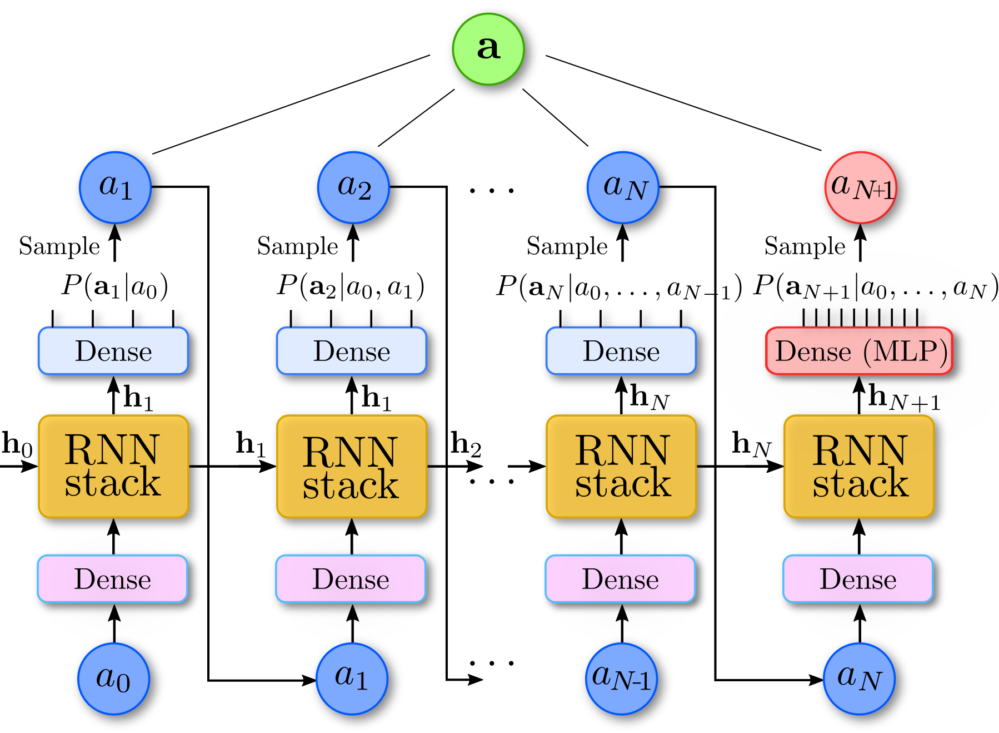

# jVMC_cavity
## _Extension of the *[jVMC](https://github.com/markusschmitt/vmc_jax)* codebase for lattice-cavity systems_

  

_(figure adapted from the original jVMC paper *[arxiv:2108.03409](https://arxiv.org/abs/2108.03409)*)_
# Motivation for this extension
`jVMC` codebase provides a complete framework to calculate time evolution of large 1-D and 2-D open quantum systems
using POVMs and neural networks. For simplicity it is assumed that the local Hilbert space dimension of the lattice 
is $d=2$, i.e., one can only simulate spin-1/2 systems. 

This extension allows one to handle dimensions $2< d < 150$, as well as different local dimensions
for the lattice (dimension $d_1$) and some other single-body quantum system, eg. a photonic cavity 
(dimension $d_2$). 

# Disclaimer
Tomasz Szołdra is not an author of the original `jVMC` package. This extension was not officially approved by the 
creators of the `jVMC` software. This project is still in the development phase.

# How to use it

- We add an extra lattice site with index $L$ that contains the configuration of the cavity mode. 
It can have a different local dimension than the lattice sites indexed by $0...(L-1)$.

- Operators are encoded by the following strings where "." is either l (lattice) or c (cavity):
  - 1-body spin: `"X_.", "Y_.", "Z_."`
  - 1-body bosonic: `"a_.", "adag_.", "n_.", "n_.(n_.-1)"`
  - 2-body spin: `"X_._X_.", "Y_._Y_.", "Z_._Z_.",` 
  - 2-body lattice-cavity: `"Sigma+_l_a_c",
                           "Sigma-_l_adag_c",
                           "X_l_a_c",
                           "X_l_adag_c",
                           "n_l_a_c",
                           "n_l_adag_c",
                           "X_l_X_c",
                           "Y_l_Y_c"
                           "Z_l_Z_c"`
- Operators acting on the cavity mode must act on site with index $L$. 
- Operators acting on the lattice must act on sites $0...(L-1)$.

# Examples

See `examples/` folder or an interactive notebook (button above).

# Current development status
## Working
- Time evolution of an open system: 1-D lattice and cavity, single- and 2-body terms in the Hamiltonian
- SIC-POVMs for higher dimensions $2 < d < 150$ are supported through the `qbsim` package.
- Spin X, Y, Z operators for arbitrary spin S
- Bosonic creation, annihilation, number operators
- Single-body observables: X, Y, Z and bosonic operators
- Exact and Monte Carlo/autoregressive sampling of the lattice/cavity system 

## To be implemented
- 2-D systems
- Observables: 2-body correlations
- Operators of arbitrary length
- Complex numbers in the RNN Ansatz

# Autoregressive sampling for lattice-cavity system
In the original setting, a dense layer (blue) is applied to the hidden state of the RNN and the log-probabilities of all
configurations are returned. Here, in the presence of cavity, autoregressive sampling is still possible after a slight modification. 
To support the cavity mode with a different local dimension, another independent dense
layer (red) is added. Then $\mathbf{a}$ is the configuration of the lattice and cavity.

It is important to note that there is another dense layer at the input to the LSTM/RNN. This change was adopted in jVMC 
commit *[a8cf7c5](https://github.com/markusschmitt/vmc_jax/commit/a8cf7c5a71886ebb38db5a2dcf0eb9dddd4f2118)*.

  

## Installation
1. We recommend you create a new conda environment to work with `jVMC_cavity`:

        conda create -n jvmc_cavity python=3.9
        conda activate jvmc_cavity
        conda install pip
        pip install --upgrade pip

3. [Optional] For GPU support:

        conda install -c conda-forge cudatoolkit=11.2 cudnn=8.2.1
        export LD_LIBRARY_PATH=$LD_LIBRARY_PATH:$CONDA_PREFIX/lib/
        mkdir -p $CONDA_PREFIX/etc/conda/activate.d
        echo 'export LD_LIBRARY_PATH=$LD_LIBRARY_PATH:$CONDA_PREFIX/lib/' > $CONDA_PREFIX/etc/conda/activate.d/env_vars.sh

3. Install two packages manually with `conda`:

        conda install -c conda-forge mpi4py openmpi

4. Download the package

        git clone https://github.com/tszoldra/jVMC_cavity
        

5. ``pip``-install the package

        pip install jVMC_cavity

6. [Optional] For GPU support:

        pip install "jax[cuda11_cudnn82]==0.3.15" -f https://storage.googleapis.com/jax-releases/jax_cuda_releases.html
        pip install --upgrade flax
     
